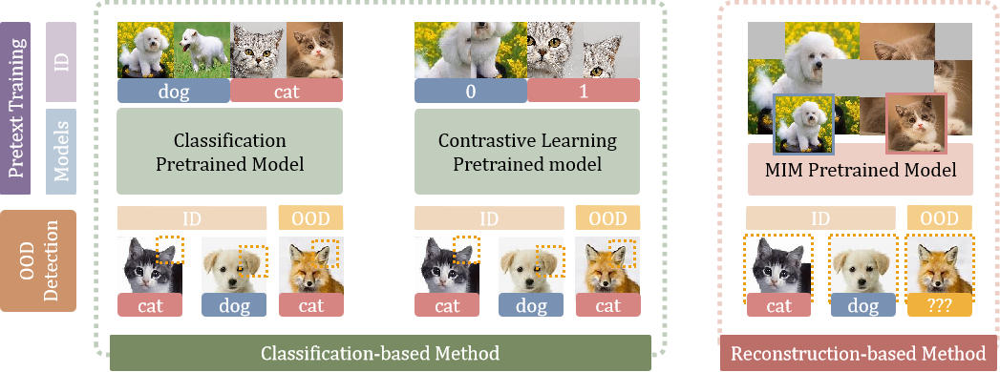

# Official code for MOODv2: Masked Image Modeling for Out-of-Distribution Detection

<p align="center">
• 🤗 <a href="https://huggingface.co/JingyaoLi/MOODv2" target="_blank">Model </a> 
• 🐱 <a href="https://github.com/dvlab-research/MOOD" target="_blank">Code</a> 
• 📃 <a href="https://arxiv.org/abs/2302.02615" target="_blank">MOODv1</a> <br>
</p>

<p align="center">

</p>

## Abstract
The crux of effective out-of-distribution (OOD) detection lies in acquiring a robust in-distribution (ID) representation, distinct from OOD samples. While previous methods predominantly leaned on recognition-based techniques for this purpose, they often resulted in shortcut learning, lacking comprehensive representations. In our study, we conducted a comprehensive analysis, exploring distinct pretraining tasks and employing various OOD score functions. The results highlight that the feature representations pre-trained through reconstruction yield a notable enhancement and narrow the performance gap among various score functions. This suggests that even simple score functions can rival complex ones when leveraging reconstruction-based pretext tasks. Reconstruction-based pretext tasks adapt well to various score functions. As such, it holds promising potential for further expansion. Our OOD detection framework, MOODv2, employs the masked image modeling pretext task. Without bells and whistles, MOODv2 impressively enhances 14.30% AUROC to 95.68% on ImageNet and achieves 99.98% on CIFAR-10.


## Performance
<p align="center">

</p>


## Datasets
Dataset source can be downloaded here.
- [ImageNet](https://www.image-net.org/). The ILSVRC 2012 dataset as In-distribution (ID) dataset. The training subset is [this file](datalists/imagenet2012_train_random_200k.txt).
- [OpenImage-O](https://github.com/openimages/dataset/blob/main/READMEV3.md). The OpenImage-O dataset is a subset of the OpenImage-V3 testing set. The filelist is [here](datalists/openimage_o.txt).
- [Texture](https://www.robots.ox.ac.uk/~vgg/data/dtd/). The filelist ruled out four classes that coincides with ImageNet is [here](datalists/texture.txt).
- [iNaturalist](https://arxiv.org/pdf/1707.06642.pdf). Follow the instructions in the [link](https://github.com/deeplearning-wisc/large_scale_ood) to prepare the iNaturalist OOD dataset.
- [ImageNet-O](https://github.com/hendrycks/natural-adv-examples). Follow the guide to download the ImageNet-O OOD dataset.

```bash
mkdir data
cd data
ln -s /path/to/imagenet imagenet
ln -s /path/to/openimage_o openimage_o
ln -s /path/to/texture texture
ln -s /path/to/inaturalist inaturalist
ln -s /path/to/imagenet_o imagenet_o
cd ..
```

## Environment
Please follow the instruction in [mmpretrain](https://github.com/open-mmlab/mmpretrain) for environment preparation.

## Demo
To predict an input image is in-distribution or out-of-distribution, we support the following OOD detection methods:
- `MSP`
- `MaxLogit`
- `Energy`
- `Energy+React`
- `ViM`
- `Residual`
- `GradNorm`
- `Mahalanobis`
- `KL-Matching`

### Example Usage 1

**Step 1: Download the features and logits**
```bash 
git clone https://huggingface.co/datasets/JingyaoLi/MOODv2-Data
cd MOODv2-Data
git lfs pull
```

**Step 2: Detect your image**
```bash
python src/demo.py \
   --img_path imgs/DTD_cracked_0004.jpg \
   --cfg configs/beit-base-p16_224px.py \
   --checkpoint pretrain/beitv2-base.pth \
   --fc_save_path data/fc.pkl \
   --id_train_feature data/imagenet_train.pkl \
   --id_val_feature data/imagenet_test.pkl \
   --methods MSP MaxLogit Energy Energy+React ViM Residual GradNorm Mahalanobis
```

For the example OOD image `imgs/DTD_cracked_0004.jpg`, you are supposed to get:
```
MSP  evaluation:   out-of-distribution 
MaxLogit  evaluation:   out-of-distribution 
Energy  evaluation:   out-of-distribution 
Energy+React  evaluation:   out-of-distribution 
ViM  evaluation:   out-of-distribution 
Residual  evaluation:   out-of-distribution 
GradNorm  evaluation:   out-of-distribution 
Mahalanobis  evaluation:   out-of-distribution
```

### Example Usage 2
In case you want to extract the features and logits from the vision encoder without downloading our preprocessed features and logits:

**Step 1: Download the checkpoint of the vision encoder**
```bash 
mkdir pretrain & cd pretrain 
wget https://huggingface.co/JingyaoLi/MOODv2/resolve/main/pretrain/beitv2-base.pth
cd ..
```

**Step 2: Extract the features and logits from the vision encoder**
```bash 
# ID train features
python src/extract_feature_vit.py $IMAGENET_PATH \
   --out_file outputs/imagenet_train.pkl \
   --cfg configs/beit-base-p16_224px.py \
   --checkpoint pretrain/beitv2-base.pth \
   --img_list datalists/imagenet2012_train_random_200k.txt 

# ID test features
python src/extract_feature_vit.py $IMAGENET_PATH \
   --out_file outputs/imagenet_test.pkl \
   --cfg configs/beit-base-p16_224px.py \
   --checkpoint pretrain/beitv2-base.pth \
   --img_list datalists/imagenet2012_val_list.txt 

# Logits
python src/extract_feature_vit.py $IMAGENET_PATH \
   --cfg configs/beit-base-p16_224px.py \
   --checkpoint pretrain/beitv2-base.pth \ 
   --fc_save_path outputs/fc.pkl \
```

**Step 3: Detect your image**
```bash
python src/demo.py \
   --img_path imgs/DTD_cracked_0004.jpg \
   --cfg configs/beit-base-p16_224px.py \
   --checkpoint pretrain/beitv2-base.pth \
   --fc_save_path outputs/fc.pkl \
   --id_train_feature outputs/imagenet_train.pkl \
   --id_val_feature outputs/imagenet_test.pkl \
   --methods MSP MaxLogit Energy Energy+React ViM Residual GradNorm Mahalanobis
```

## OOD Detection Benchmark
**Step 1: Download the checkpoint of the vision encoder**
|  Name |  Paper  | Config  | Checkpoint | Train/Test Command |
|:------:|:-------:|:-------:|:-------:|:-------:|
| BEiT   | [paper](https://arxiv.org/abs/2106.08254) | [config](configs/beit-base-p16_224px.py) | [ckpt](https://download.openmmlab.com/mmclassification/v0/beit/beit-base_3rdparty_in1k_20221114-c0a4df23.pth) | [README](https://github.com/open-mmlab/mmpretrain/tree/main/configs/beit) |
| BEiTv2 | [paper](https://arxiv.org/abs/2208.06366) | [config](configs/beit-base-p16_224px.py) | [ckpt](https://download.openmmlab.com/mmclassification/v0/beit/beitv2-base_3rdparty_in1k_20221114-73e11905.pth) | [README](https://github.com/open-mmlab/mmpretrain/tree/main/configs/beitv2) |
| ViT    | [paper](https://arxiv.org/abs/2010.11929) | [config](configs/vit-base-p16_224px.py) | [ckpt](https://download.openmmlab.com/mmclassification/v0/vit/vit-base-p16_pt-32xb128-mae_in1k_20220623-4c544545.pth) | [README](https://github.com/open-mmlab/mmpretrain/tree/main/configs/vision_transformer) |
| MoCov3 | [paper](https://arxiv.org/abs/2104.02057) | [config](configs/vit-base-p16_224px.py) | [ckpt](https://download.openmmlab.com/mmselfsup/1.x/mocov3/mocov3_vit-base-p16_16xb256-amp-coslr-300e_in1k/vit-base-p16_ft-8xb64-coslr-150e_in1k/vit-base-p16_ft-8xb64-coslr-150e_in1k_20220826-f1e6c442.pth) | [README](https://github.com/open-mmlab/mmpretrain/tree/main/configs/mocov3) |
| DINOv2 | [paper](https://arxiv.org/abs/2304.07193) | [config](configs/vit-base-p14_224px.py) | [ckpt](https://download.openmmlab.com/mmpretrain/v1.0/dinov2/vit-base-p14_dinov2-pre_3rdparty_20230426-ba246503.pth) | [README](https://github.com/open-mmlab/mmpretrain/tree/main/configs/dinov2) |


**Step 2: Extract the features and logits from the vision encoder**

Step 2.1 Extract features
   ```bash
   python src/extract_feature_vit.py $DATA_ROOT $OUT_FILE --cfg $CFG --checkpoint $CHECKPOINT --img_list $IMG_LIST
   ```
   e.g.
   ```bash
   python extract_feature_vit.py data/imagenet outputs/vit_imagenet_val.pkl --cfg $CFG --checkpoint $CHECKPOINT --img_list datalists/imagenet2012_val_list.txt
   python extract_feature_vit.py data/imagenet outputs/vit_train_200k.pkl  --cfg $CFG --checkpoint $CHECKPOINT --img_list datalists/imagenet2012_train_random_200k.txt
   python extract_feature_vit.py data/openimage_o outputs/vit_openimage_o.pkl  --cfg $CFG --checkpoint $CHECKPOINT --img_list datalists/openimage_o.txt
   python extract_feature_vit.py data/texture outputs/vit_texture.pkl  --cfg $CFG --checkpoint $CHECKPOINT --img_list datalists/texture.txt
   python extract_feature_vit.py data/inaturalist outputs/vit_inaturalist.pkl  --cfg $CFG --checkpoint $CHECKPOINT 
   python extract_feature_vit.py data/imagenet_o outputs/vit_imagenet_o.pkl  --cfg $CFG --checkpoint $CHECKPOINT 
   python extract_feature_vit.py data/cifar10 outputs/vit_cifar10_train.pkl  --cfg $CFG --checkpoint $CHECKPOINT  --img_list datalists/cifar10_train.txt
   python extract_feature_vit.py data/cifar10 outputs/vit_cifar10_test.pkl  --cfg $CFG --checkpoint $CHECKPOINT  --img_list datalists/cifar10_test.txt
   ```

Step 2.2 Extract weights and bias in fc
   ```bash
   python src/extract_feature_vit.py $DATA_ROOT $OUT_FILE --cfg $CFG --checkpoint $CHECKPOINT --fc_save_path $FC_SAVE_PATH
   ```
   e.g.
   ```bash
   python src/extract_feature_vit.py $DATA_ROOT $OUT_FILE --cfg $CFG --checkpoint $CHECKPOINT --fc_save_path outputs/vit_fc.pkl 
   ```

**Step 3: Evaluation**
   ```bash
   python src/benchmark.py $FC_SAVE_PATH $ID_DATA $ID_TRAIN_FEATURE $ID_VAL_FEATURE $OOD_FEATURE
   ```
   e.g.
   ```bash
   python src/benchmark.py outputs/vit_fc.pkl outputs/vit_train_200k.pkl outputs/vit_imagenet_val.pkl outputs/vit_openimage_o.pkl outputs/vit_texture.pkl outputs/vit_inaturalist.pkl outputs/vit_imagenet_o.pkl
   python src/benchmark.py outputs/vit_fc.pkl outputs/vit_cifar10_train.pkl outputs/vit_cifar10_test.pkl outputs/vit_openimage_o.pkl outputs/vit_texture.pkl outputs/vit_inaturalist.pkl outputs/vit_imagenet_o.pkl
   ```

## Acknowledgement
Part of the code is modified from [ViM](https://github.com/haoqiwang/vim) repo.

