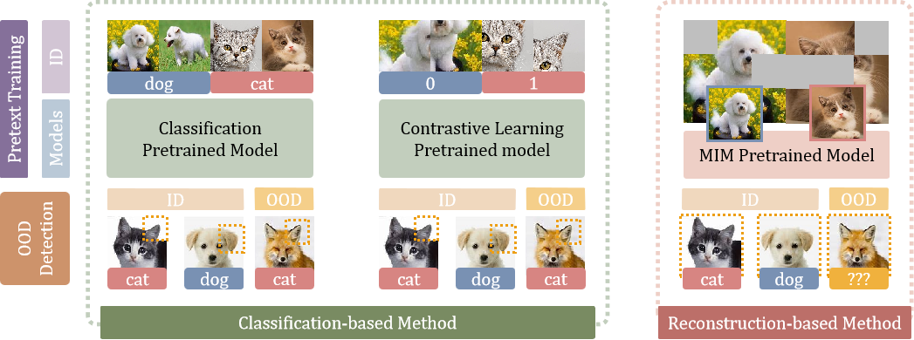
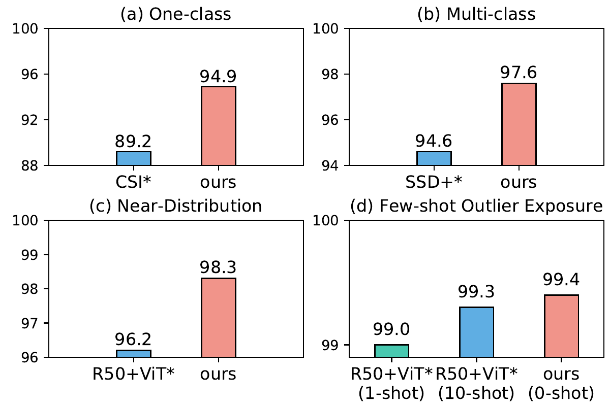
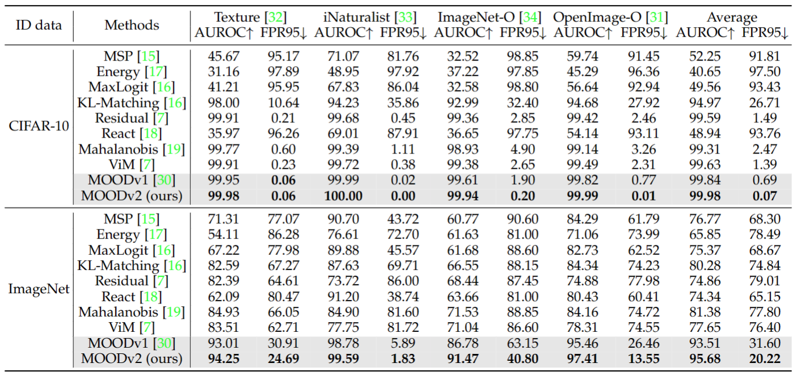

# MOOD

• 🤗 <a href="https://huggingface.co/JingyaoLi/MOODv2" target="_blank">Model </a> 
• 🐱 <a href="https://github.com/dvlab-research/MOOD" target="_blank">Code</a> 
• 📃 <a href="https://arxiv.org/abs/2302.02615" target="_blank">MOODv1</a>
• 📃 <a href="https://arxiv.org/abs/2401.02611" target="_blank">MOODv2</a>  

## MOODv1: Rethinking Out-of-Distribution Detection: Masked Image Modeling is All You Need (CVPR2023)
The core of out-of-distribution (OOD) detection is to learn the in-distribution (ID) representation, which is distinguishable from OOD samples. Previous work applied recognition-based methods to learn the ID features, which tend to learn shortcuts instead of comprehensive representations. In this work, we find surprisingly that simply using reconstruction-based methods could boost the performance of OOD detection significantly. We deeply explore the main contributors of OOD detection and find that reconstruction-based pretext tasks have the potential to provide a generally applicable and efficacious prior, which benefits the model in learning intrinsic data distributions of the ID dataset. Specifically, we take Masked Image Modeling as a pretext task for our OOD detection framework (MOOD). Without bells and whistles, MOOD outperforms previous SOTA of one-class OOD detection by 5.7%, multi-class OOD detection by 3.0%, and near-distribution OOD detection by 2.1%. It even defeats the 10-shot-per-class outlier exposure OOD detection, although we do not include any OOD samples for our detection.

## MOODv2: Masked Image Modeling for Out-of-Distribution Detection (TPAMI2024)
The crux of effective out-of-distribution (OOD) detection lies in acquiring a robust in-distribution (ID) representation, distinct from OOD samples. While previous methods predominantly leaned on recognition-based techniques for this purpose, they often resulted in shortcut learning, lacking comprehensive representations. In our study, we conducted a comprehensive analysis, exploring distinct pretraining tasks and employing various OOD score functions. The results highlight that the feature representations pre-trained through reconstruction yield a notable enhancement and narrow the performance gap among various score functions. This suggests that even simple score functions can rival complex ones when leveraging reconstruction-based pretext tasks. Reconstruction-based pretext tasks adapt well to various score functions. As such, it holds promising potential for further expansion. Our OOD detection framework, MOODv2, employs the masked image modeling pretext task. Without bells and whistles, MOODv2 impressively enhances 14.30% AUROC to 95.68% on ImageNet and achieves 99.98% on CIFAR-10.

